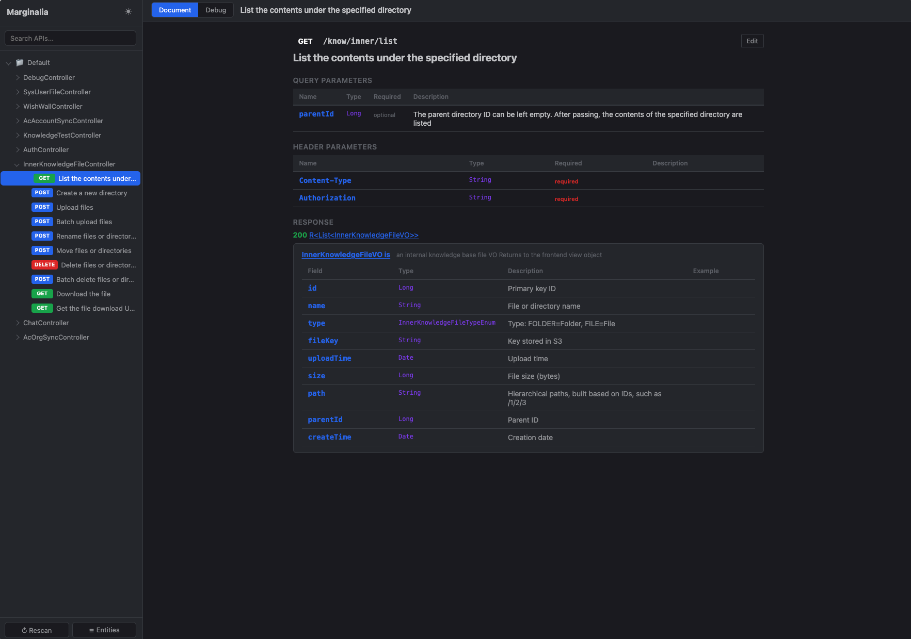
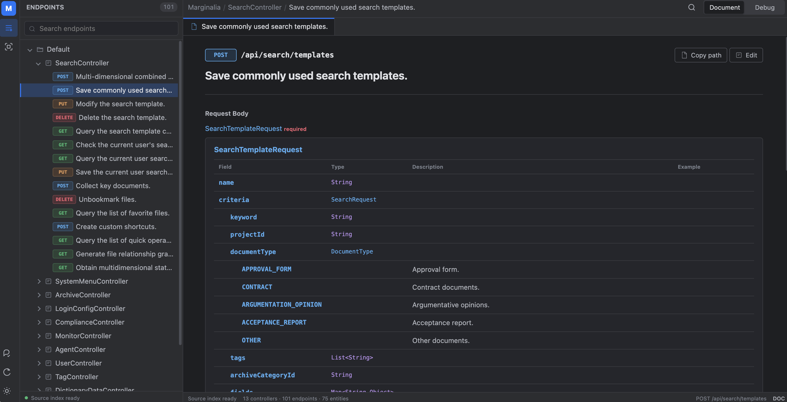
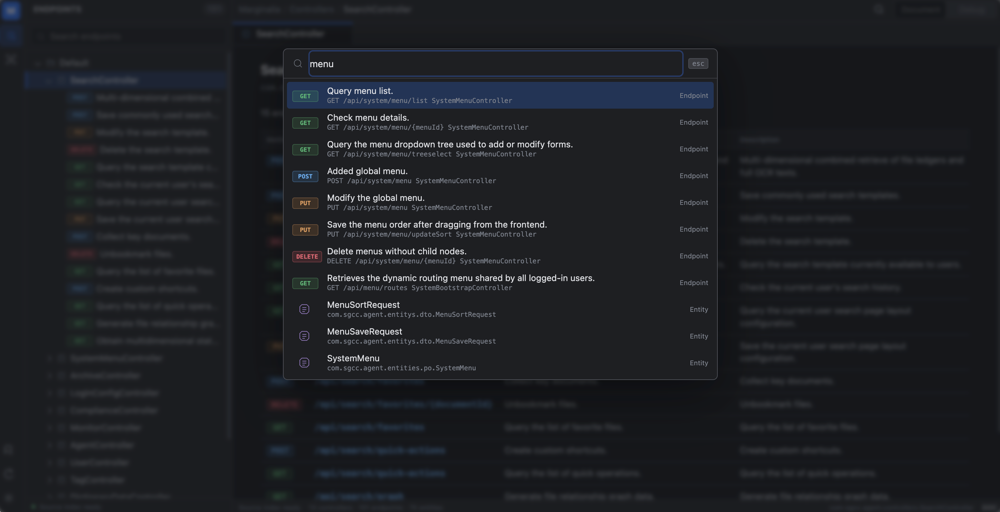
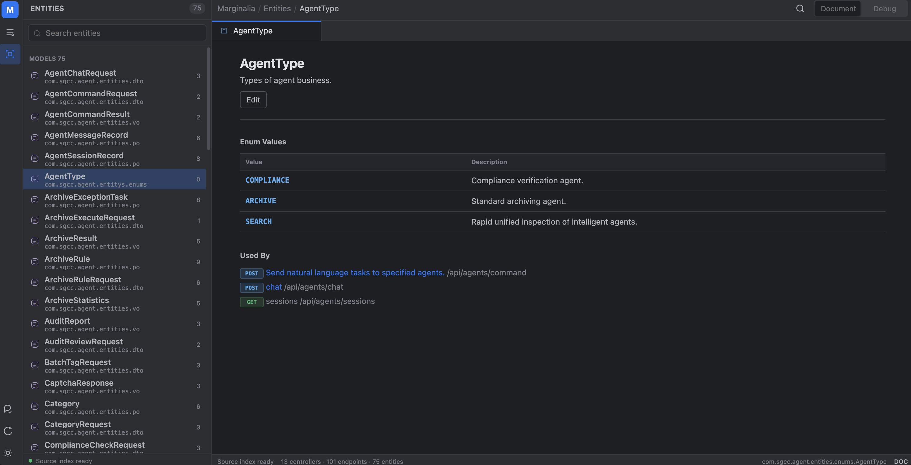
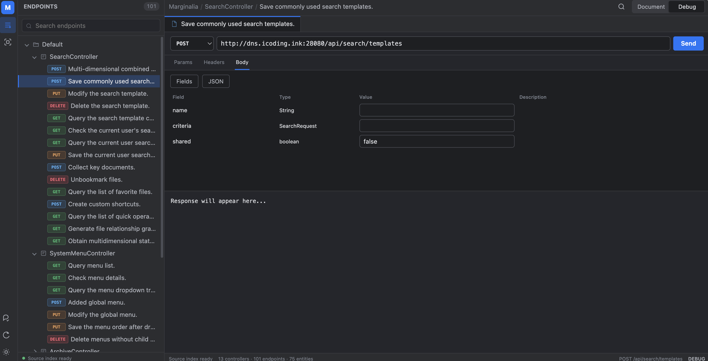

<p align="center">
  <b>中文</b> | <a href="./README.md">English</a>
</p>

<p align="center">
  
  
  <br/>
  
  
  
</p>

<h1 align="center">Marginalia</h1>

<p align="center">
  <b>从源码注释自动生成 API 文档的 Spring Boot Starter</b>
</p>

<p align="center">
  无需注解侵入，直接从 Java 源码的 Javadoc 和注释中提取 API 文档。<br/>
  内置紧凑的 IDEA 风格 Web UI，支持文档浏览、实体导航和接口调试。
</p>

<p align="center">
  <a href="https://github.com/onlyGuo/Marginalia/stargazers"></a>
  &nbsp;
  <a href="https://github.com/onlyGuo/Marginalia/network/members"></a>
  &nbsp;
  <a href="https://github.com/onlyGuo/Marginalia/watchers"></a>
</p>

---

<p align="center">
  
  <br/>
  <sub>Controller 与接口总览</sub>
</p>

---

## 特性

- **零注解侵入** — 不需要在代码中添加任何额外注解，直接从 Javadoc、行注释、Swagger 注解中提取文档
- **优先级机制** — Javadoc > 行注释 > Swagger 注解 > 方法签名
- **内置 Web UI** — 紧凑的 IDEA 风格界面，支持文档模式和调试模式
- **接口调试** — 内置 HTTP 客户端，支持发送请求、自定义 Headers/Params、查看响应，支持 SSE
- **实体自动发现** — 自动从请求/响应体类型中发现实体类，展示完整字段结构
- **字段级合并** — 用户编辑的内容在重新扫描时不会丢失
- **目录持久化** — 文档数据以文件形式存储，重启后保留所有编辑
- **开箱即用** — Spring Boot Starter，添加依赖即可使用

## 快速开始

### 1. 添加依赖

```xml
<dependency>
    <groupId>ink.icoding</groupId>
    <artifactId>marginalia-spring-boot-starter</artifactId>
    <version>1.1.6</version><!-- version -->
</dependency>
```

### 2. 启动应用

启动 Spring Boot 应用后，访问 `http://localhost:8080/marginalia` 即可看到文档页面。

### 3. 配置（可选）

在 `application.yaml` 中添加配置：

```yaml
marginalia:
  enabled: true                    # 是否启用，默认 true
  prefix: /marginalia             # Web UI 访问路径，默认 /marginalia
  base-package: com.example       # 扫描的基础包名，为空则扫描所有
  source-dirs:                    # 源码目录，为空则自动检测
    - src/main/java
  data-dir: ./marginalia-data     # 文档数据存储目录
  auto-scan: true                 # 启动时自动扫描
  debugger-enabled: true          # 是否启用调试功能
  title: API 文档                  # 自定义标题
```

## 工作原理

1. **启动时扫描** — 应用启动时自动扫描项目源码目录中的所有 Java 文件
2. **解析控制器** — 使用 JavaParser 解析 `@Controller` / `@RestController` 类
3. **提取文档** — 按优先级从 Javadoc、注释、注解中提取 API 描述信息
4. **发现实体** — 自动从请求/响应体类型中发现并解析实体类（支持嵌套泛型）
5. **合并持久化** — 与已有数据合并，用户编辑的内容优先保留
6. **提供 UI** — 通过内置 Web 界面展示文档，支持浏览和调试

## 文档来源优先级

| 来源 | 示例 | 优先级 |
|------|------|--------|
| Javadoc | `/** 获取用户信息 */` | 最高 |
| 行注释 | `// 获取用户信息` | 高 |
| Swagger 注解 | `@ApiOperation("获取用户信息")` | 中 |
| 方法签名 | `getUserInfo()` | 最低 |

## Web UI 功能

### 文档模式
- 接口路径、HTTP 方法、描述
- 路径参数、查询参数、请求头参数
- 请求体（支持实体字段级展示）
- 响应体（支持实体字段级展示 + JSON 示例）
- 点击实体名称可跳转到实体详情页

<p align="center">
  
  <br/>
  <sub>请求体中的嵌套实体与枚举会递归展开</sub>
</p>

### 快速导航

使用 `Ctrl/Cmd + K` 可同时搜索接口名称、路径、Controller、实体和枚举，并直接跳转到目标文档。

<p align="center">
  
  <br/>
  <sub>跨接口与实体的快速导航</sub>
</p>

### 实体与枚举

- 独立的实体导航视图，支持按名称和包名搜索
- 递归展示嵌套子实体、集合泛型和枚举值
- 展示实体被哪些接口引用，并支持反向跳转

<p align="center">
  
  <br/>
  <sub>实体、枚举值及接口引用关系</sub>
</p>

### 调试模式
- 选择 HTTP 方法，输入 URL
- 自定义 Params、Headers、Body
- 发送请求查看响应
- 支持 SSE（Server-Sent Events）
- 编辑的内容自动保存，刷新不丢失

<p align="center">
  
  <br/>
  <sub>在 Debug 模式中编辑请求参数并查看实时响应</sub>
</p>

## 项目结构

```
marginalia/
├── marginalia-core                    # 核心库
│   ├── model/                         # 数据模型
│   ├── parser/                        # 源码解析器（JavaParser）
│   ├── scanner/                       # 源码扫描器
│   ├── persistence/                   # 目录持久化
│   └── service/                       # 核心服务
└── marginalia-spring-boot-starter     # Spring Boot Starter
    ├── autoconfigure/                 # 自动配置
    └── resources/static/marginalia/   # Web UI（单文件 SPA）
```

## 许可证

[GPLv3](./LICENSE)
